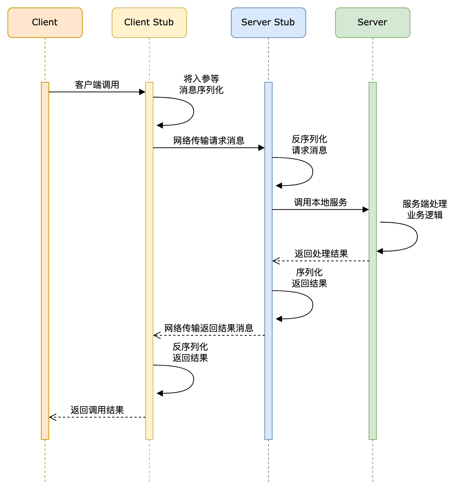

# JRPC
### 启动流程

1.version1.2版本以上需要安装zookeeper，安装参考和zookeeper文档：[zookeeper](./doc/zookeeper.md)

2.启动zookeeper服务端，zkServer.cmd

3.先运行server包下的server.java，然后运行client包下的client.txt

### RPC概念

通常所说的RPC其实是说的RPC协议，即一种专门为服务间远程调用而设计的一种通用协议。 该协议基于其它已有的传输协议，规定通信方式为C/S架构；并且在代码开发过程中要屏蔽掉底层通信细节， 让开发者像调用本地方法一样，调用远程服务。

#### 常用RPC框架

1. 应用级的服务框架：阿里的 Dubbo/Dubbox、Google gRPC、Spring Boot/Spring Cloud。
2. 远程通信协议：RMI、Socket、SOAP(HTTP XML)、REST(HTTP JSON)。
3. 通信框架：MINA 和 Netty

#### RPC组成

RPC的体系结构通常包括以下几个部分：

​	1.客户端 (Client): 发起RPC调用的进程或程序。

​	2.客户端存根 (Client Stub): 封装客户端请求，将调用参数序列化，并将请求发送到服务器。

​	3.服务器 (Server): 提供实际服务并处理来自客户端的RPC请求的进程或程序。

​	4.服务器存根 (Server Stub): 解封客户端请求，将参数反序列化并调用实际的服务器端方法，然后将结果返回给客户端。

​	5.通信协议: 定义客户端和服务器之间的数据传输方式，通常是基于TCP/IP或HTTP协议。

​	6.网络: 客户端与服务器之间的通信通道，通常是互联网或局域网。

#### 架构图

#### 调用过程

#### RPC功能实现

RPC功能的实现主要分为：服务寻址、序列化和反序列化、网络传输功能。

##### Call ID映射

​	1、本地：在本地方法调用中，函数体是直接通过函数指针来指定的，但是在远程调用中，由于两个进程的地址空间完全不一样，函数指针不起作用。
​	2、远程：RPC中所有函数或方法都有自己的一个ID（programID），在所有进程中都唯一。客户端在做远程过程调用时，必须附上这个ID，即客户端会查一下表，找出相应的Call ID，然后传给服务端，服务端也会查表，来确定客户端需要调用的函数，然后执行相应函数的代码。
​	3、Call ID映射表一般是一个哈希表。

##### 序列化和反序列化功能（类似压缩于解压）

**概述**
	1、序列化：将消息对象转换为二进制流。
	2、反序列化：将二进制流转换为消息对象。
**必要性**
	1、远程调用涉及到数据的传输，在本地调用中，只需要将数据压入栈中，然后让函数去栈中读取即可。
	2、但远程的数据传输，由于客户端和服务端不在同一个服务器上，涉及不同的进程，不能通过内存传递参数，此时就需要将客户端先将请求参数转成字节流（编码），传递给服务端，服务端再将字节流转为自己可读取格式（解码），这就是序列化和反序列化的过程。反之，服务端返回值也逆向经历序列化和反序列化到客户端。
序列化的优势
	1、将消息对象转为二进制字节流，便于网络传输。
	2、可跨平台、跨语言。

##### 网络传输功能

**作用**
	1、客户端将Call ID和序列化后的参数字节流传输给服务端。
	2、服务端将序列化后的调用结果回传给客户端。
**协议**：主要有TCP、UDP、HTTP协议。

**基于TCP协议（常用）**
	1、客户端和服务端建立Socket连接。
	2、客户端通过Socket将需要调用的接口名称、方法名称及参数序列化后传递给服务端。
	3、服务端反序列化后再利用反射调用对应的方法，将结果返回给客户端。
**基于HTTP协议**
	1、客户端向服务端发送请求，如GET、POST、PUT、DELETE等请求。
	2、服务端根据不同的请求参数和请求URL进行方法调用，返回JSON或者XML数据结果。
**TCP和HTTP对比**
	1、基于TCP协议实现的RPC调用，由于是底层协议栈，更佳灵活的对协议字段进行定制，可减少网络开销，提高性能，实现更大的吞吐量和并发数。但底层复杂，实现代价高。
	2、基于HTTP协议实现的RPC调用，已封装实现序列化，但HTTP属于应用层协议，HTTP传输所占用的字节数比TCP更高，传输效率对比TCP较低。

## version1.0

#### version1.1

- 实现基本的rpc调用
- 客户端动态代理
- 定义统一的request和response

#### version1.2

- 引入netty框架进行信息传输
- 自定义消息格式

#### version1.3

- 引入zookeeper作为注册中心

## version2.0

#### version2.1

- netty自定义编码器，解码器和序列化器

- 在客户端建立本地服务缓存
- 实现本地缓存的动态更新

## version3.0

#### version3.1

- 实现客户端的负载均衡

- 实现客户端的容错：失败重传
- 服务白名单

## version4.0

#### version4.1

- 服务限流，降级的实现
- 熔断器的实现
