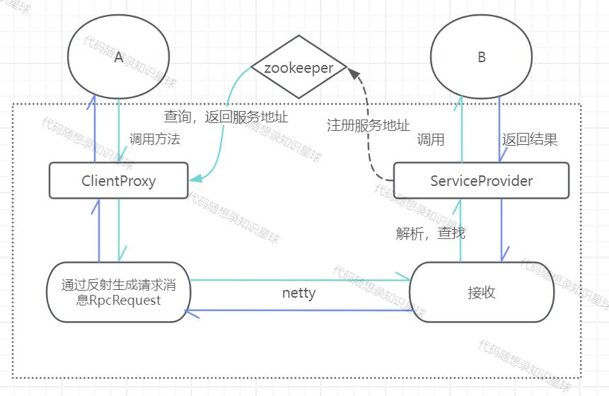

## 引入zookeeper作为注册中心

[zookeeper安装和基础文档](../../../../../doc/Zookeeper.md)

在part1 和part2 中，在调用服务时，对目标的ip地址和端口port都是写死的，默认本机地址和9999端口号

在实际场景下，服务的地址和端口会被记录到【注册中心】中。服务端上线时，在注册中心注册自己的服务与对应的地址，而客户端调用服务时，去注册中心根据服务名找到对应的服务端地址。这里使用zookeeper作为注册中心。

zookeeper是经典的分布式数据一致性解决方案，致力于为分布式应用提供一个高性能，高可用，且具有严格顺序访问控制能力的分布式协调存储服务。

1. 高性能
   - `zookeeper`将全量数据存储在**内存**中，并直接服务于客户端的所有非事务请求，尤其用于以读为主的应用场景
2. 2.高可用
   - `zookeeper`一般以集群的方式对外提供服务，一般`3~5`台机器就可以组成一个可用的 `Zookeeper`集群了，每台机器都会在内存中维护当前的服务器状态，井且每台机器之间都相互保持着通信。只要集群中超过一半的机器都能够正常工作，那么整个集群就能够正常对外服务
3. 3.严格顺序访问
   - 对于来自客户端的每个更新请求，`Zookeeper`都会分配一个全局唯一的递增编号，这个编号反应了所有事务操作的先后顺序

#### 环境配置：

pom.xml中引入Curator客户端，需要根据zookeeper版本选择Curator版本

```xml
<!--这个jar包应该依赖log4j,不引入log4j会有控制台会有warn，但不影响正常使用-->
<dependency>
    <groupId>org.apache.curator</groupId>
    <artifactId>curator-recipes</artifactId>
    <version>5.1.0</version>
</dependency>
```

zookeeper的bin目录下双击zkServer.cmd启动服务

#### 客户端重构

与原先写死的ip和port不同，这次外界调用时直接创建ClientProxy，不用给参数

Client中如下

```java
ClientProxy clientProxy=new ClientProxy();
UserService userService = clientProxy.createProxy(UserService.class);
User user = proxy.getUserByUserId(1);
System.out.println("从服务端得到的user="+user.toString());
```

ClientProxy中也一样，去掉ip和port变量

```java
public class ClientProxy {
    // 定义接口动态指定实现类
    private RpcClient rpcClient;
    public ClientProxy(){
        rpcClient=new NettyRpcClient();
    }
    /**
     * 创建代理对象进行消息的发送
     * @param clazz 被代理的对象
     * @return 执行后的结果
     * @param <T> 被代理对象的类型
     */
    @SuppressWarnings("unchecked")
    public <T>T createProxy(Class<T> clazz){
        return (T)Proxy.newProxyInstance(clazz.getClassLoader(),
                new Class[]{clazz},
                (proxy, method, args) -> {
                    RpcRequest request = RpcRequest.builder()
                            .interfaceName(method.getDeclaringClass().getName())
                            .methodName(method.getName())
                            .params(args)
                            .paramsType(method.getParameterTypes())
                            .build();
                    RpcResponse rpcResponse = rpcClient.sendRequest(request);
                    return rpcResponse.getData();
                });
    }
}
```

改为在rpcClient.sendRequest方法中，先去注册中心中查找服务对应的ip和port，再去连接对应的服务器

```java
public class NettyRpcClient implements RpcClient {
    private static final Bootstrap bootstrap;
    private static final EventLoopGroup eventLoopGroup;
    private final ServiceCenter serviceCenter;
    public NettyRpcClient(){
        this.serviceCenter=new ZKServiceCenter();
    }
    //netty客户端初始化
    static {
        eventLoopGroup = new NioEventLoopGroup();
        bootstrap = new Bootstrap();
        bootstrap.group(eventLoopGroup).channel(NioSocketChannel.class)
                //NettyClientInitializer这里 配置netty对消息的处理机制
                .handler(new NettyClientInitializer());
    }

    @Override
    public RpcResponse sendRequest(RpcRequest request) {
        try {
            // 从注册中心获取IP和端口号
            InetSocketAddress address = serviceCenter.serviceDiscovery(request.getInterfaceName());
            InetAddress host = address.getAddress();
            int port = address.getPort();
            // 和服务器建立连接
            ChannelFuture channelFuture = bootstrap.connect(host, port).sync();
            Channel channel = channelFuture.channel();
            // 发送信息
            channel.writeAndFlush(request);
            // 阻塞式关闭channel，获取特定名字下的channel中的内容（这个在handler中设置）
            channel.closeFuture().sync();
            AttributeKey<RpcResponse> key = AttributeKey.valueOf("RPCResponse");
            RpcResponse response = channel.attr(key).get();
            System.out.println("服务器返回结果"+response);
            return response;
        } catch (InterruptedException e) {
            e.printStackTrace();
        }
        return null;
    }
}
```

实现向注册中心中查询 服务地址的类 是实现ServiceCenter接口的ZKServiceCenter类

```java
public class ZKServiceCenter implements ServiceCenter{
    private CuratorFramework client;
    //zookeeper根路径节点
    public static final String ROOT_PATH = "RPC";
	//负责zookeeper客户端的初始化，并与zookeeper服务端进行连接
    public ZKServiceCenter() {
        // 重试策略
        ExponentialBackoffRetry retry = new ExponentialBackoffRetry(1000, 3);
        // zookeeper的地址固定，不管是服务提供者还是，消费者都要与之建立连接
        // sessionTimeoutMs 与 zoo.cfg中的tickTime 有关系，
        // zk还会根据minSessionTimeout与maxSessionTimeout两个参数重新调整最后的超时值。默认分别为tickTime 的2倍和20倍
        // 使用心跳监听状态
        this.client = CuratorFrameworkFactory.builder()
                .connectString("127.0.0.1:2181")
                .sessionTimeoutMs(40000)
                .retryPolicy(retry)
                .namespace(ROOT_PATH).build();
        client.start();
        System.out.println("连接建立成功");
    }
	//根据服务名（接口名）返回地址
    @Override
    public InetSocketAddress serviceDiscovery(String serviceName) {
        try {
            List<String> strings = client.getChildren().forPath("/" + serviceName);
            // TODO 这里需要负载均衡
            String s = strings.get(0);
            return parseAddress(s);
        } catch (Exception e) {
            e.printStackTrace();
            throw new RuntimeException(e);
        }
    }
	 // 字符串解析为地址
    private InetSocketAddress parseAddress(String s) {
        String[] result = s.split(":");
        return new InetSocketAddress(result[0], Integer.parseInt(result[1]));
    }

}
```

#### 服务端重构

注册服务，在ServiceProvider添加一个ServiceRegister变量用于注册服务到注册中心在服务端上线时调用ServiceProvider的provideServiceInterface方法中添加逻辑，使得本地注册服务时也注册服务到注册中心上

```java
public class ServiceProvider {
    // 保存接口类名，和实现类
    private Map<String,Object> interfaceProvider;
    private int port;
    private String host;
    private ServiceRegister serviceRegister;
    // 传入自身的IP和端口号
    public ServiceProvider(String host,int port){
        this.host = host;
        this.port = port;
        this.serviceRegister = new ZKServiceRegister();
        this.interfaceProvider = new HashMap<>();

    }
    ////本地注册服务
    public void provideServiceInterface(Object service){
        String serviceName=service.getClass().getName();
        Class<?>[] interfaceName=service.getClass().getInterfaces();

        for (Class<?> clazz:interfaceName){
            // 本地映射表
            interfaceProvider.put(clazz.getName(),service);
            // 注册中心注册IP
            serviceRegister.register(clazz.getName(),new InetSocketAddress(host,port));
        }

    }
    //获取服务实例
    public Object getService(String interfaceName){
        return interfaceProvider.get(interfaceName);
    }
}
```

实现ServiceRegister接口的ZKServiceRegister类，提供了注册服务到注册中心的register方法

```java
public class ZKServiceRegister implements ServiceRegister {
    private CuratorFramework client;
    private static final String ROOT_PATH = "RPC";
    public ZKServiceRegister(){
        // 指数时间重试
        RetryPolicy policy = new ExponentialBackoffRetry(1000, 3);
        // zookeeper的地址固定，不管是服务提供者还是，消费者都要与之建立连接
        // sessionTimeoutMs 与 zoo.cfg中的tickTime 有关系，
        // zk还会根据minSessionTimeout与maxSessionTimeout两个参数重新调整最后的超时值。默认分别为tickTime 的2倍和20倍
        // 使用心跳监听状态
        this.client = CuratorFrameworkFactory.builder().connectString("127.0.0.1:2181")
                .sessionTimeoutMs(40000).retryPolicy(policy).namespace(ROOT_PATH).build();
        this.client.start();
        System.out.println("zookeeper 连接成功");
    }
    @Override
    public void register(String serviceName, InetSocketAddress serviceAddress) {
        try {
            // serviceName创建成永久节点，服务提供者下线时，不删服务名，只删地址
            if(client.checkExists().forPath("/" + serviceName) == null){
                client.create().creatingParentsIfNeeded().withMode(CreateMode.PERSISTENT).forPath("/" + serviceName);
            }
            // 路径地址，一个/代表一个节点
            String path = "/" + serviceName +"/"+ getServiceAddress(serviceAddress);
            // 临时节点，服务器下线就删除节点
            client.create().creatingParentsIfNeeded().withMode(CreateMode.EPHEMERAL).forPath(path);
        } catch (Exception e) {
            throw new RuntimeException(e);
        }
    }

    private String getServiceAddress(InetSocketAddress serviceAddress) {
        return serviceAddress.getHostName() +
                ":" +
                serviceAddress.getPort();
    }
    // 字符串解析为地址
    private InetSocketAddress parseAddress(String address) {
        String[] result = address.split(":");
        return new InetSocketAddress(result[0], Integer.parseInt(result[1]));
    }
}
```

架构图：



